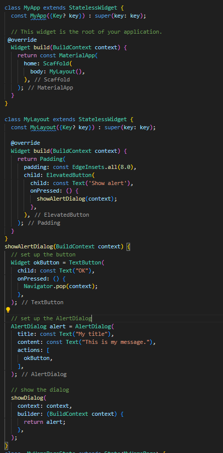

# Laporan Praktikum Flutter - [Kevin Arullah Herdiansyah] - [2241760125]

## Praktikum 1: [Membuat Project Flutter Baru]
### Deskripsi

### Langkah-langkah
1. [Buka VS Code, lalu tekan tombol Ctrl + Shift + P maka akan tampil Command Palette, lalu ketik Flutter. Pilih New Application Project.]
    
2. [Kemudian buat folder sesuai style laporan praktikum yang Anda pilih. Disarankan pada folder dokumen atau desktop atau alamat folder lain yang tidak terlalu dalam atau panjang. Lalu pilih Select a folder to create the project in.]
    
3. [Buat nama project flutter hello_world seperti berikut, lalu tekan Enter. Tunggu hingga proses pembuatan project baru selesai.]
     

## Praktikum 2: [Menghubungkan Perangkat Android atau Emulator]
### Deskripsi

### Langkah-langkah
1. Melanjutkan dari praktikum 1, Anda diminta untuk menjalankan aplikasi ke perangkat fisik (device Android atau iOS). Silakan ikuti langkah-langkah pada codelab tautan berikut ini.]

### Hasil

## Praktikum 3: [Membuat Repository GitHub dan Laporan Praktikum]
### Deskripsi

### Langkah-langkah
1. [ klik tombol "Create repository" lalu akan tampil seperti gambar berikut.]

### Hasil

## Praktikum 4: [Menerapkan Widget Dasar]
### Deskripsi

### Langkah-langkah
1. [Buat folder baru basic_widgets di dalam folder lib. Kemudian buat file baru di dalam basic_widgets dengan nama text_widget.dart. 
    Ketik atau salin kode program berikut ke project hello_world Anda pada file text_widget.dart.]
    

2. [Lakukan import file text_widget.dart ke main.dart, lalu ganti bagian text widget dengan kode di atas. Maka hasilnya seperti gambar berikut. Screenshot hasil milik Anda, lalu dibuat laporan pada file README.md.]
    

3. [Buat sebuah file image_widget.dart di dalam folder basic_widgets dengan isi kode berikut.]
    

4. [Lakukan penyesuaian asset pada file pubspec.yaml dan tambahkan file logo Anda di folder assets project hello_world.]
    

5. [Jangan lupa sesuaikan kode dan import di file main.dart kemudian akan tampil gambar seperti berikut.]
    

## Praktikum 5: [Menerapkan Widget Material Design dan iOS Cupertino]
### Deskripsi

### Langkah-langkah
1. [Buat file di basic_widgets > loading_cupertino.dart. Import stateless widget dari material dan cupertino. Lalu isi kode di dalam method Widget build adalah sebagai berikut.]
    
2. [Buat file di basic_widgets > fab_widget.dart. Import stateless widget dari material. Lalu isi kode di dalam method Widget build adalah sebagai berikut.]
    
3.  [Ubah isi kode main.dart seperti berikut.]
    
4.  [Dialog widget pada flutter memiliki dua jenis dialog yaitu AlertDialog dan SimpleDialog. Ubah isi kode main.dart seperti berikut.]
    
5.  [Flutter menyediakan widget yang dapat menerima input dari pengguna aplikasi yaitu antara lain Checkbox, Date and Time Pickers, Radio Button, Slider, Switch, TextField. Contoh penggunaan TextField widget adalah sebagai berikut:]
    
6.  [Date and Time Pickers termasuk pada kategori input dan selection widget, berikut adalah contoh penggunaan Date and Time Pickers.]
    
7.  [Hasil Akhir]
    